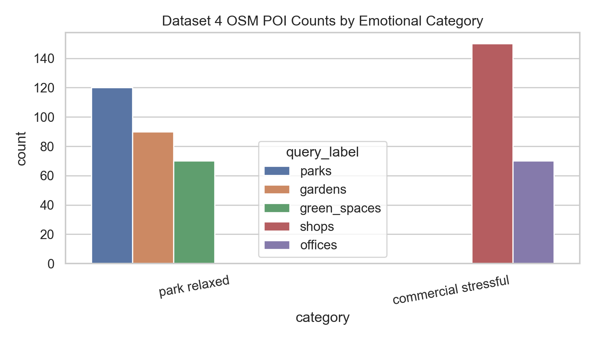
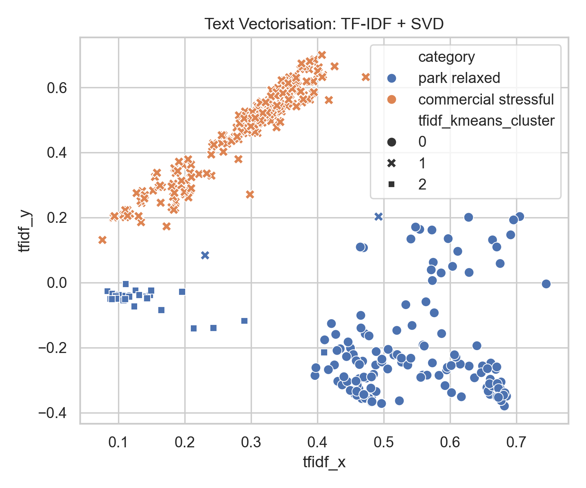
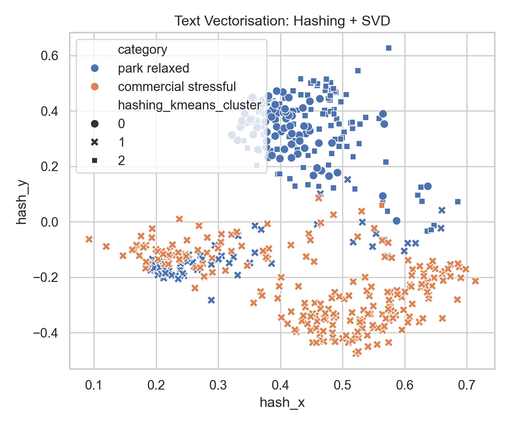
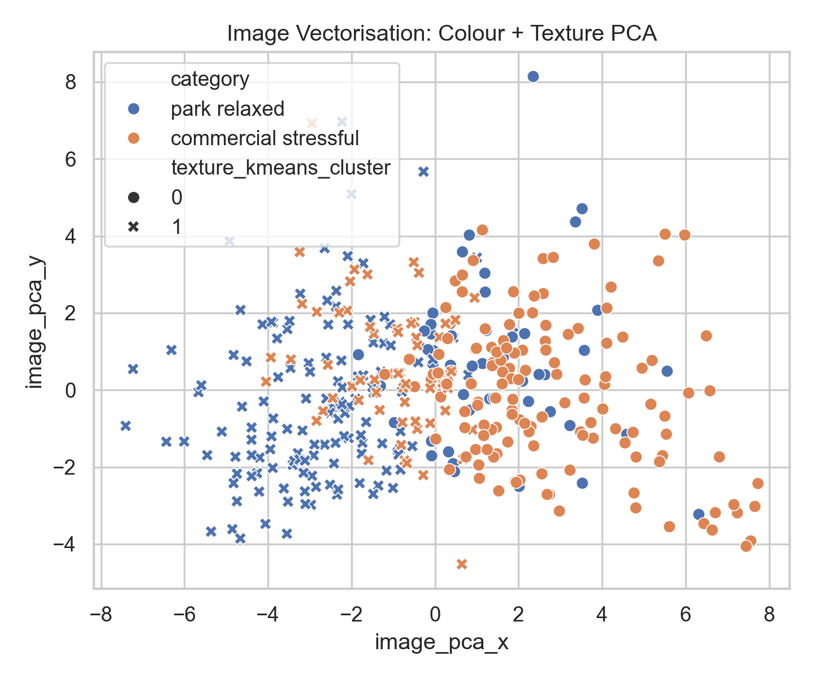
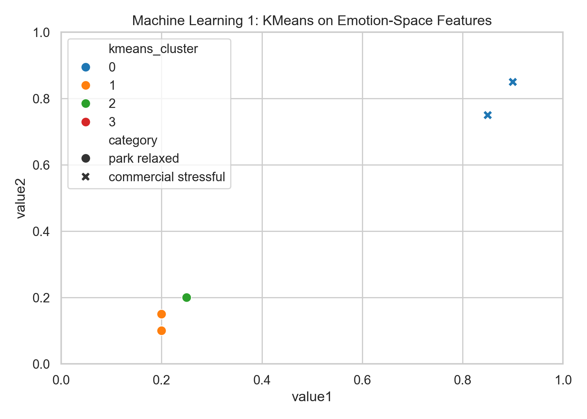
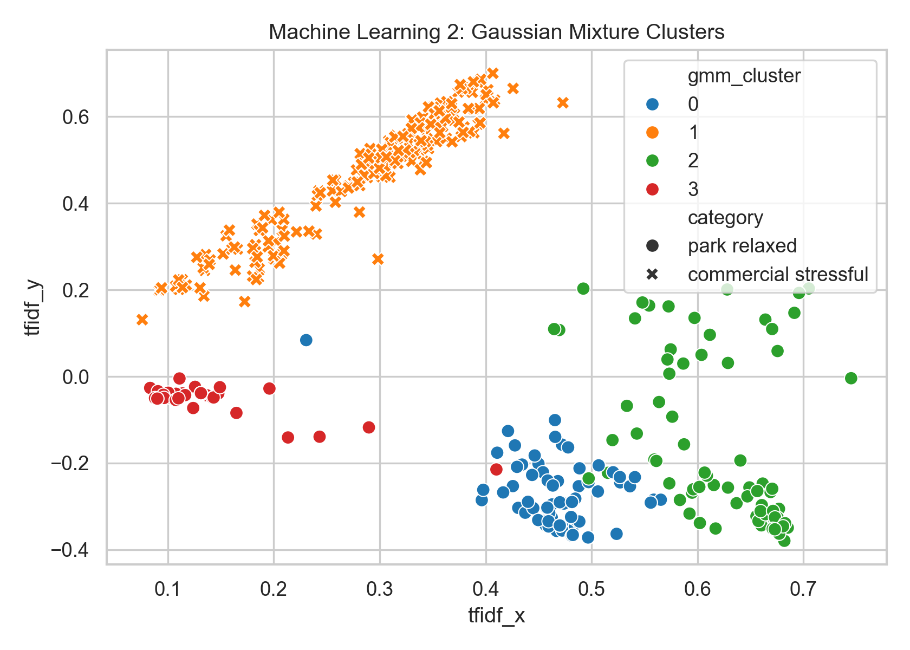
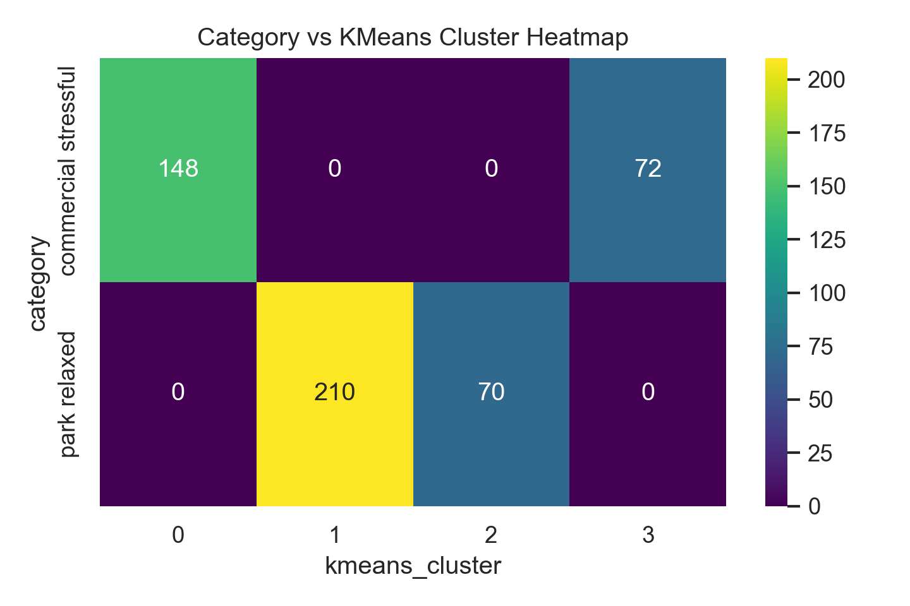
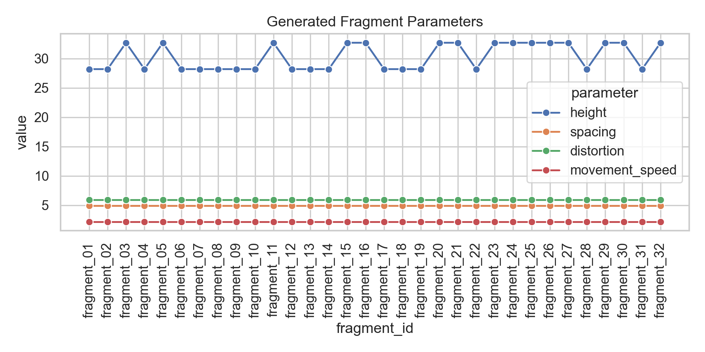

# 城市情绪地图

## 将城市情绪转化为数据驱动的空间生成系统

学生：Kaiying Huang  
项目主题：一个城市的情绪地图  
核心概念：公园 = 放松 / 开放，商业 = 紧张 / 密集，交通 = 压迫 / 快速  
软件环境：Python、Cinema 4D、Processing

---

# Project Status / 项目状态

## 项目目标

本项目将机器学习输出，包括向量特征、聚类结果和情绪参数，转化为空间生成的设计规则。项目的核心问题是：城市是否可以被理解为一个情绪场？在这个情绪场中，公园被解释为放松和开放的空间，商业区域被解释为紧张和密集的空间，交通节点被解释为压迫、快速和方向性强的空间。

最终设计结果是一个“情绪生成的城市”。每一种情绪条件都会对应一种空间规则：

- 放松 / 开放：较低高度、较大间距、较慢运动、蓝绿色调。
- 紧张 / 密集：较高建筑、较小间距、较快运动、红橙色调。
- 压迫 / 快速：方向性路径、过渡性节奏、压缩的通道空间。

整个工作流将数据采集、向量化、机器学习、可视化和三维生成连接起来。数据不是只停留在分析层面，而是被转化为 32 个建筑片段，并通过动画形成一个持续变化的空间系统。

---

# Part 1: Projecting Between Domains / 跨领域投射

## 1.1 Web Scraping and Data Collection / 数据采集

本项目主要使用三个数据集，来自两个不同的数据领域：Pinterest 图像数据和 OpenStreetMap 城市空间点位数据。同时，项目也准备了 Google Maps 评论采集器，可以在拥有 API key 的情况下扩展为评论文本数据集。

## Dataset 1: Park / Relaxed Image Dataset

来源：Pinterest  
领域：图像 / 社交媒体图片搜索  
文件夹：`photos1/`  
元数据：`metadata/pinterest_future_city_metadata.csv`  
采集数量：200 个图像文件  
实际可读取并用于分析的图像：188 张

该数据集代表放松、开放的城市氛围，包括公园、花园、绿地和景观空间等图像参考。在设计逻辑中，这些图像对应低密度、慢节奏、开放的空间条件。

## Dataset 2: Commercial / Stressful Image Dataset

来源：Pinterest  
领域：图像 / 社交媒体图片搜索  
文件夹：`photos2/`  
元数据：`metadata/pinterest_business environment_metadata.csv`  
采集数量：200 个图像文件  
实际可读取并用于分析的图像：199 张

该数据集代表密集的商业氛围，包括商业街、办公环境、购物空间以及视觉信息更复杂的城市图像。在设计逻辑中，这些图像对应高密度、压缩、垂直化和快速变化的空间条件。

## Dataset 3: OpenStreetMap Urban POI Dataset

来源：OpenStreetMap / Overpass API  
领域：实时空间数据 / 城市点位数据  
输出文件：`workflow/01_data_collection/dataset4_openstreetmap_poi/outputs/openstreetmap_poi_dataset.csv`  
采集数量：500 个元素

类别分布：

- `park relaxed`：280 条
- `commercial stressful`：220 条

OpenStreetMap 数据集包含真实城市元素的名称、标签、坐标和情绪类别。它为项目提供了空间锚点：项目不只是使用氛围图像，也使用真实城市位置，例如公园、花园、商店和办公区域。

Google Maps 评论扩展：

Google Maps 评论采集器位于：

`workflow/01_data_collection/dataset3_google_maps_reviews/`

该采集器可以通过 Google Places API 采集 200-300 条真实评论记录，但需要 `GOOGLE_MAPS_API_KEY`。由于当前环境没有 API key，因此该部分作为已准备好的扩展模块记录，而不是作为已生成数据使用。

---

## 1.2 Dataset Vectorisation / 数据集向量化

向量化用于将图像和文本/空间数据转化为机器可以处理的特征空间。

## 文本 / POI 向量化

输入数据：OpenStreetMap POI 名称和标签  
输出文件：`workflow/02_vectorisation/outputs/text_vectorisation_tfidf_vs_hashing.csv`

本项目比较了两种文本向量化方法：

1. TF-IDF + SVD
2. HashingVectorizer + SVD

选择 TF-IDF 的原因是它具有较强的可解释性。它可以把 `park`、`garden`、`shop`、`office` 等词语和 OSM 标签直接连接回设计判断。这对于设计报告很重要，因为特征不是完全黑箱的。

选择 HashingVectorizer 作为对比方法，是因为它速度快、可扩展性强，不需要保存词表。但它的缺点是可解释性较弱。

实验结果：

- TF-IDF silhouette：0.235
- Hashing silhouette：0.109
- 两种聚类结果的一致性 ARI：0.490

结果解释：

在该数据集中，TF-IDF 表现更好。OSM 标签本身很短、很结构化，因此词表中的关键词具有明确意义。Hashing 方法虽然更快，但解释性较弱，聚类分离度也更低。

## 图像向量化

输入数据：Pinterest 公园图像与 Pinterest 商业图像  
输出文件：`workflow/02_vectorisation/outputs/image_vectorisation_colour_texture.csv`

本项目比较了两种图像向量化策略：

1. 颜色统计和 HSV 颜色直方图
2. 颜色 + 纹理 / 边缘特征

选择颜色特征的原因是，公园和商业空间的情绪差异部分体现在视觉色彩上。公园图像通常包含更多绿色、蓝色、柔和光线和开放感；商业图像则更容易出现强对比、硬质表面、标识、玻璃和人工照明。

加入纹理和边缘特征作为对比，是因为商业空间通常具有更多硬边界、视觉杂讯和复杂几何。

实验结果：

- 有效图像：387 张
- 颜色特征 silhouette：0.306
- 颜色 + 纹理特征 silhouette：0.251
- 两种聚类结果一致性 ARI：0.822

结果解释：

颜色特征比纹理特征更能区分该数据集。纹理增加了细节，但也带来噪声，因为一些公园图像中也包含路径和建筑，而一些商业图像中也可能有较平滑的表面。

---

## 1.3 API Interaction / API 交互

API 生成脚本位于：

`workflow/01_data_collection/dataset5_api_synthetic_emotion_text/scripts/generate_emotion_text_api.py`

该脚本使用 OpenAI API 生成结构化的城市情绪观察文本。每条生成内容包括：

- 感官观察
- 情绪解释
- 空间规则
- 关键词

该部分用于扩展已有的图像和空间数据集，把情绪描述直接转化为空间语法。例如：

- 放松的公园氛围 -> 水平展开、宽间距、慢节奏
- 紧张的商业氛围 -> 垂直压力、密集网格、快节奏
- 压迫的交通氛围 -> 方向性通道和压缩等待空间

该脚本需要用户自己的 `OPENAI_API_KEY`。项目中不保存任何 API key。

---

## 1.4 Machine Learning / 机器学习

本项目使用 OSM POI 数据和向量化特征比较了两种机器学习模型。

输入文件：

`workflow/03_machine_learning/outputs/osm_ml_clusters_kmeans_vs_gmm.csv`

特征包括：

- value1
- value2
- TF-IDF SVD x/y
- Hashing SVD x/y

## Model 1: KMeans Clustering

KMeans 用于将城市元素分成情绪空间聚类。它适合本项目，因为设计系统需要清晰的聚类标签，并将它们映射成空间规则。

结果：

- KMeans silhouette：0.635

## Model 2: Gaussian Mixture Model

Gaussian Mixture Model 作为第二种机器学习方法进行对比。与 KMeans 不同，GMM 允许数据属于概率分布，因此更适合解释情绪模糊或过渡空间。

结果：

- GMM silhouette：0.494

对比解释：

在该数据集中，KMeans 表现更好，因为情绪参数区分较明显：放松/开放空间具有较低的 `value1/value2`，商业/紧张空间具有较高的 `value1/value2`。GMM 在概念上仍然有价值，因为它可以表达情绪过渡区域，但在当前特征空间中，KMeans 更适合直接生成建筑片段。

---

## 1.5 Visualising and Plotting / 可视化

项目使用 Matplotlib 和 Seaborn 生成分析图表。图像保存在：

`workflow/04_visualisation/outputs/`

主要输出包括：

- 数据类别数量图
- TF-IDF 向量化图
- Hashing 向量化图
- 图像颜色/纹理 PCA 图
- KMeans 聚类图
- GMM 聚类图
- 类别-聚类热力图
- 建筑片段参数变化图

---

# Part 2: Design Tool Integration / 设计工具整合

## 2.1 Project Brief / 项目工具说明

设计工作流使用 Python、Cinema 4D 和 Processing。

Python 用于数据清洗、向量化、机器学习和建筑片段参数生成。它将采集到的数据转化为空间规则 CSV。

Cinema 4D 用作主要三维建模和动画环境。它读取片段参数和情绪逻辑，生成公园与商业对比的三维城市场景。

Processing 用作实时动画和交互环境。它通过鼠标控制情绪轴：鼠标向左是放松/开放/公园，鼠标向右是紧张/密集/商业。

---

## 2.2 Integrated Workflows / 集成工作流

## Workflow A: 数据到片段参数

Pinterest 图像和 OSM 数据在 Python 中处理。图像被转化为颜色/纹理特征，OSM 标签被转化为文本向量。机器学习聚类结果进一步转化为高度、间距、扰动、运动速度、颜色和场景位置。

输出文件：

`workflow/05_design_tool_integration/fragment_parameters/emotion_city_fragments_32.csv`

## Workflow B: 片段参数到 Cinema 4D

Cinema 4D 读取情绪规则并生成三维场景。场景清晰地区分：

- 左侧：公园 / 放松 / 开放
- 右侧：商业 / 紧张 / 密集

Cinema 4D 脚本：

`workflow/05_design_tool_integration/cinema4d/generate_emotion_city_c4d.py`

## Workflow C: 情绪规则到 Processing

Processing 使用同一套情绪空间规则进行交互演示。用户通过鼠标控制情绪轴：

- 左侧 = 放松、开放、公园化
- 右侧 = 紧张、密集、商业化

Processing sketch：

`python_processing/python_processing.pde`

---

## 2.3 Iterative Reconfiguration / 迭代重构

最终片段系统包含 32 个建筑片段：

`workflow/05_design_tool_integration/fragment_parameters/emotion_city_fragments_32.csv`

每个片段都通过规则生成，而不是手工逐个建模。片段来自机器学习聚类结果和情绪设计参数。

设计规则：

- 更高的 `value1` -> 更强的紧张感 -> 更高的建筑
- 更高的 `value2` -> 更强的密度 -> 更小间距和更大体量
- KMeans cluster -> 片段变体分组
- 情绪类别 -> 色彩系统
- movement speed -> 动画节奏
- distortion -> 空间不稳定性

---

## 2.4 3D Scenes and Animation / 三维场景与动画

Cinema 4D 脚本：

`workflow/05_design_tool_integration/cinema4d/generate_emotion_city_c4d.py`

该脚本生成公园与商业对比的三维情绪城市，并设置 1800 帧、30 fps 的时间轴，即 60 秒动画。

Processing 动画：

`python_processing/python_processing.pde`

该 sketch 创建实时情绪城市，观众可以在放松/开放和紧张/密集两种城市状态之间移动。

预览动画：

`workflow/06_report_assets/emotion_city_preview_65s.mp4`

该预览动画长度为 65 秒，可以作为报告或评图时的快速预览版本。

---

# Project Conclusion / 项目总结

本项目将城市媒体和空间数据转化为情绪生成系统。图像提供氛围参考，OSM 数据提供真实城市位置，向量化将数据转化为特征空间，机器学习提取聚类结构，设计工具进一步将这些聚类转化为建筑片段。

完整工作流为：

数据采集 -> 向量化 -> 机器学习 -> 可视化分析 -> 片段规则 -> Cinema 4D / Processing 动画

因此，“情绪城市”不只是一个视觉比喻，而是一个数据驱动的设计工具。城市情绪类别可以直接生成空间差异和建筑形态变化。

---

# Key File Index / 文件索引

数据：

- `photos1/`
- `photos2/`
- `metadata/pinterest_future_city_metadata.csv`
- `metadata/pinterest_business environment_metadata.csv`
- `workflow/01_data_collection/dataset4_openstreetmap_poi/outputs/openstreetmap_poi_dataset.csv`

向量化：

- `workflow/02_vectorisation/scripts/run_emotion_city_pipeline.py`
- `workflow/02_vectorisation/outputs/text_vectorisation_tfidf_vs_hashing.csv`
- `workflow/02_vectorisation/outputs/image_vectorisation_colour_texture.csv`

机器学习：

- `workflow/03_machine_learning/outputs/osm_ml_clusters_kmeans_vs_gmm.csv`
- `workflow/03_machine_learning/outputs/ml_metrics.json`

设计工具：

- `workflow/05_design_tool_integration/fragment_parameters/emotion_city_fragments_32.csv`
- `workflow/05_design_tool_integration/cinema4d/generate_emotion_city_c4d.py`
- `python_processing/python_processing.pde`

动画：

- `workflow/06_report_assets/emotion_city_preview_65s.mp4`

---

# Submission Checklist / 提交检查

- 最终 PDF 报告
- GitHub 仓库链接
- 数据集和脚本
- OneDrive 公开文件夹
- 动画和三维文件
- 上传前删除所有 API key
- 不上传 `.env` 文件
- 如果旧 notebook 中出现过 API key，需要撤销并重新生成 key
